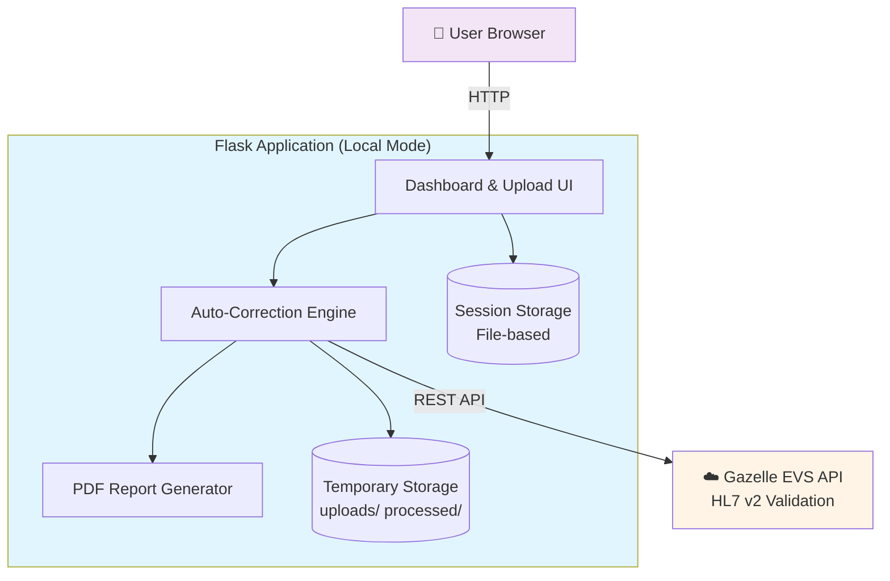
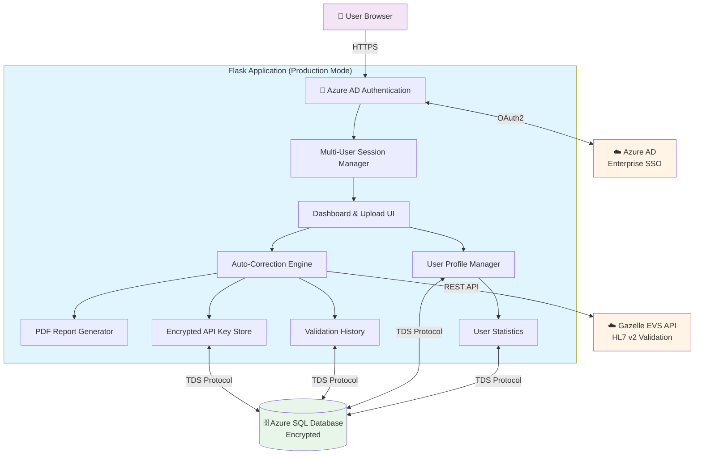
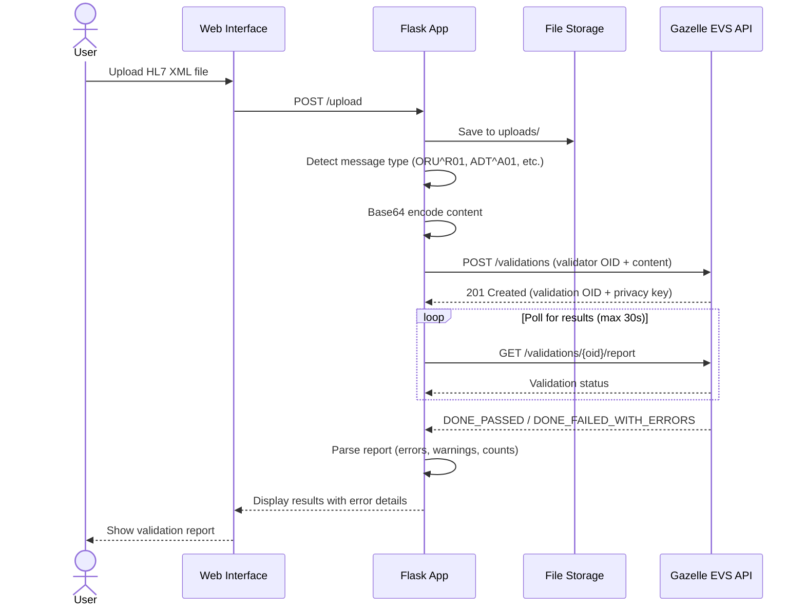
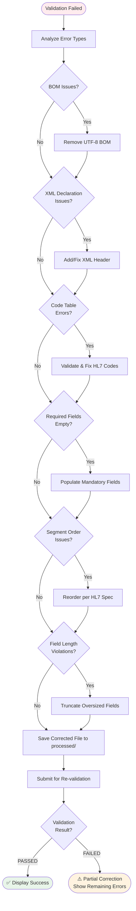
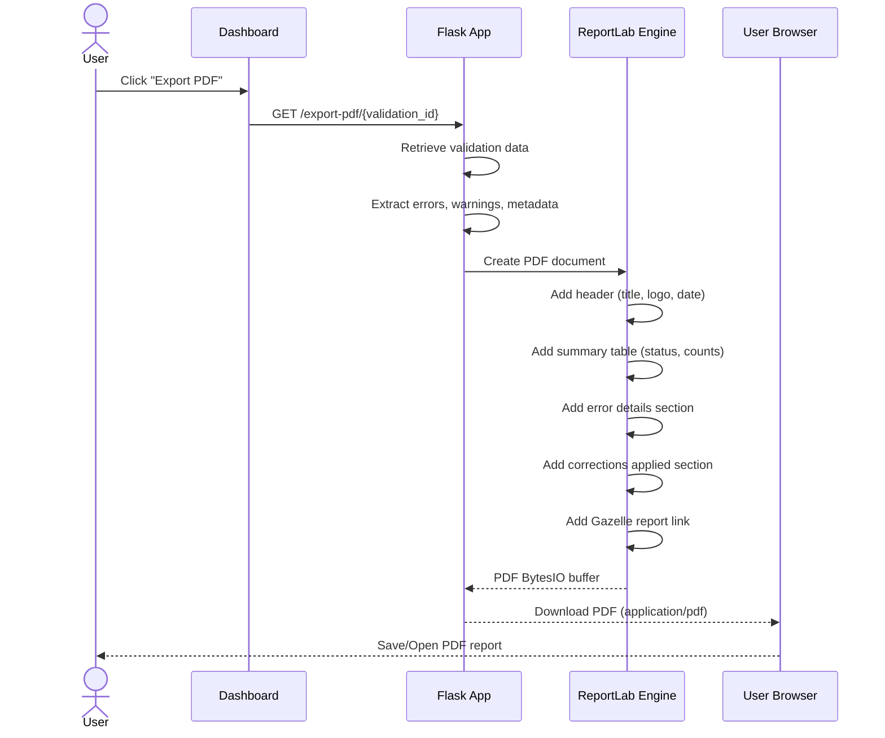
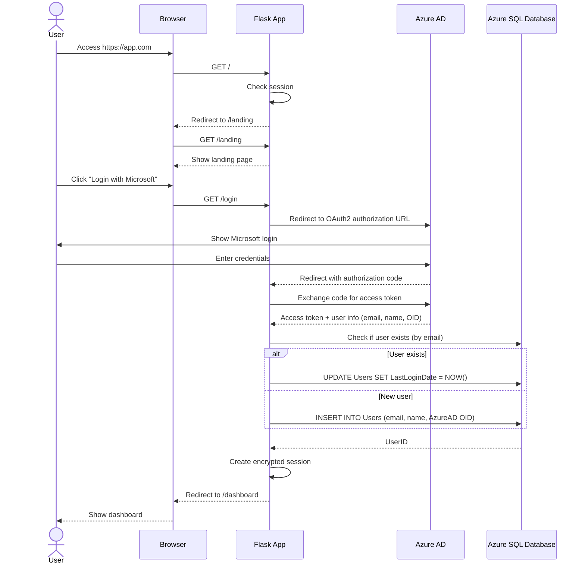
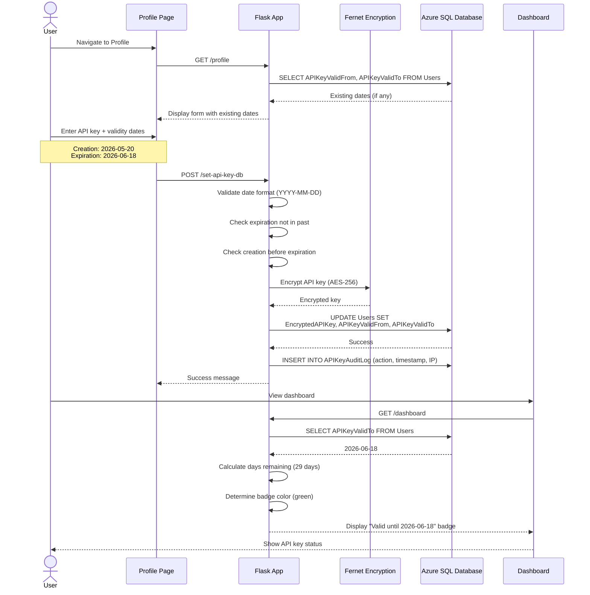
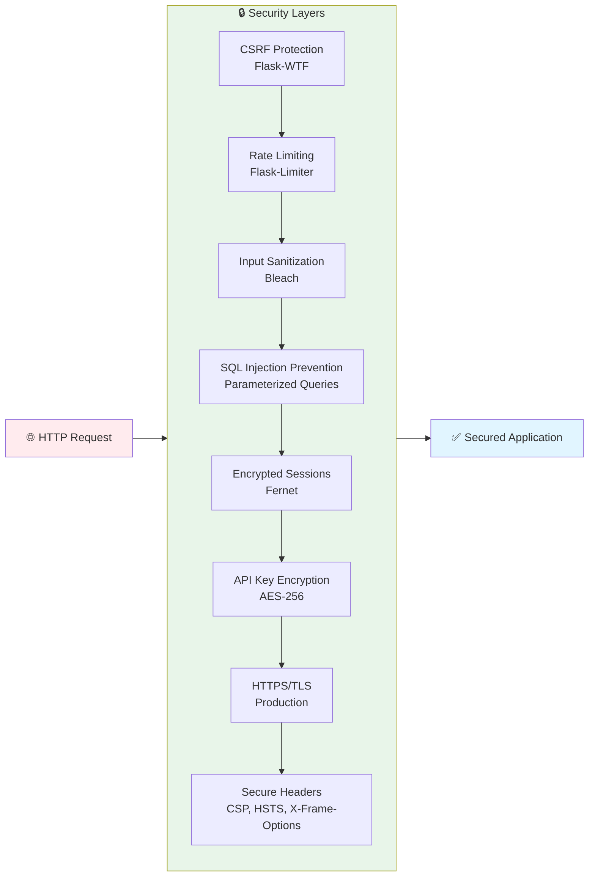
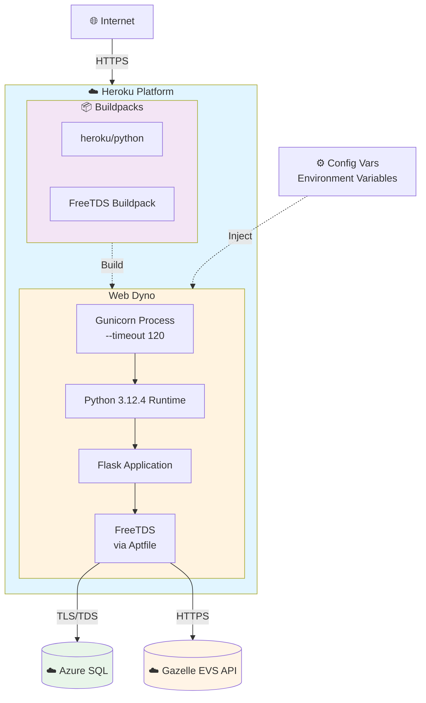

# HL7 v2 Message Validator & Auto-Corrector

A comprehensive web application for validating and auto-correcting HL7 v2 Healthlink XML files using the Gazelle EVS API. Supports both local development and enterprise deployment with Azure AD authentication.

## ✨ Features

### Core Validation
- 🔍 **HL7 v2 File Validation** - Upload and validate against Gazelle EVS API
- 🤖 **Intelligent Auto-Correction** - Automatically fixes common HL7 message errors
- 📊 **Detailed Validation Reports** - Comprehensive error analysis with line numbers
- 📄 **PDF Export** - Generate professional validation reports (ReportLab)
- 🔄 **Batch Processing** - Validate multiple files simultaneously

### Enterprise Features (Production Mode)
- 🔐 **Azure AD Authentication** - Single Sign-On with Microsoft 365
- 👥 **Multi-User Support** - Isolated user spaces with personal dashboards
- 📝 **Validation History** - Persistent storage of all validations in Azure SQL
- 🔑 **Encrypted API Key Storage** - Secure per-user API key management
- 📈 **User Statistics** - Track validation success rates and usage

### Developer Features (Local Mode)
- ⚡ **Quick Start** - No Azure setup required for testing
- 🛠️ **API Key Management** - Session-based API key storage
- 🎨 **Modern UI** - Clean Bootstrap 5 interface
- 🔒 **Security** - CSRF protection, rate limiting, secure headers

## 🚀 Quick Start

### Option 1: Docker (Recommended)

**Local Mode** - No Azure required (5 minutes):
```bash
# 1. Copy environment template
cp .env.docker.example .env

# 2. Edit .env and set:
APP_MODE=local
GAZELLE_API_KEY=your_api_key_from_gazelle

# 3. Generate session key
python -c "import secrets; print(secrets.token_hex(32))"
# Copy output to SESSION_SECRET_KEY in .env

# 4. Start Docker
docker-compose up -d

# 5. Open browser
http://localhost:5000
```

**Production Mode** - With Azure AD (30 minutes):
See [DOCKER_CONFIGURATION.md](DOCKER_CONFIGURATION.md) for complete Azure setup guide.

### Option 2: Local Python Development

```bash
# 1. Create virtual environment
python -m venv .venv
.venv\Scripts\activate  # Windows
source .venv/bin/activate  # Linux/Mac

# 2. Install dependencies
pip install -r requirements.txt

# 3. Configure environment
cp .env.docker.example .env
# Edit .env and set APP_MODE=local and GAZELLE_API_KEY

# 4. Run application
python dashboard_app.py

# 5. Open browser
http://localhost:5000
```

## 📖 Documentation

| Document | Description |
|----------|-------------|
| [DOCKER_CONFIGURATION.md](DOCKER_CONFIGURATION.md) | Complete Docker setup guide with Azure integration |
| [DOCKER_DEPLOYMENT.md](DOCKER_DEPLOYMENT.md) | Production deployment to Azure Container Apps/App Service |
| [DOCKER_QUICK_START.md](DOCKER_QUICK_START.md) | Quick reference for common Docker commands |
| [AZURE_REQUIREMENTS.md](AZURE_REQUIREMENTS.md) | Why Azure credentials are user-provided |
| [LOCAL_DEVELOPMENT_GUIDE.md](LOCAL_DEVELOPMENT_GUIDE.md) | Local Python development without Docker |

## 🎯 Application Modes


### 🟢 Local Mode (Default)
**Best for:** Development, testing, single-user validation

**Features:**
- ✅ Full HL7 validation and auto-correction
- ✅ PDF report generation
- ✅ Batch processing
- ✅ No login required - direct dashboard access
- ❌ No user authentication
- ❌ No persistent validation history

**Requirements:**
- Gazelle API key only
- No Azure setup needed

**Configuration:**
```env
APP_MODE=local
GAZELLE_API_KEY=your_key_here
SESSION_SECRET_KEY=generated_secret
```

### 🔵 Production Mode
**Best for:** Enterprise deployment, multi-user teams, audit compliance

**Additional Features:**
- ✅ Azure AD authentication (Single Sign-On)
- ✅ Multi-user support with isolated user spaces
- ✅ Persistent validation history in Azure SQL Database
- ✅ Encrypted per-user API key storage
- ✅ User statistics and audit trails
- ✅ Session persistence across restarts

**Requirements:**
- Azure AD app registration (free)
- Azure SQL Database (~$5/month)
- Gazelle API key

**Configuration:**
```env
APP_MODE=production
# Azure AD credentials
AZURE_AD_CLIENT_ID=...
AZURE_AD_CLIENT_SECRET=...
AZURE_AD_TENANT_ID=...
# Azure SQL Database
AZURE_SQL_SERVER=...
AZURE_SQL_DATABASE=...
AZURE_SQL_USERNAME=...
AZURE_SQL_PASSWORD=...
```

See [DOCKER_CONFIGURATION.md](DOCKER_CONFIGURATION.md) for detailed setup.

## 🏗️ Target Architecture

### System Overview

The HL7 v2 Message Validator operates in two distinct architectural modes, supporting both standalone development and enterprise multi-user deployments.

#### Local Mode Architecture



#### Production Mode Architecture



### Operational Flows

#### 1. File Upload & Validation Flow



#### 2. Auto-Correction Workflow



#### 3. PDF Report Generation Flow



#### 4. User Authentication Flow (Production Mode)



#### 5. API Key Management Flow



### Component Details

#### Flask Application Layer
- **Dashboard** - Validation history, statistics, and file management
- **Upload Interface** - Drag-drop file upload with batch processing
- **Auto-Correction Engine** - Intelligent HL7 error detection and fixing
- **PDF Generator** - ReportLab-based professional report creation
- **Authentication** - Azure AD integration (production mode)

#### Data Persistence Layer
**Local Mode:**
- File-based session storage (`flask_session/`)
- Temporary file storage (`uploads/`, `processed/`)

**Production Mode:**
- Azure SQL Database (persistent validation history)
- Encrypted API key storage with per-user validity dates
- User profiles and statistics
- Audit logs

#### External Services
- **Gazelle EVS API** - HL7 v2.4 validation service
  - Supports 13+ Healthlink message types
  - REST API with persistent report URLs
  - OID-based validator selection
- **Azure AD** (Production) - Enterprise SSO authentication
- **Azure SQL** (Production) - Managed database service

### Security Architecture



### Deployment Architectures

#### Docker Deployment

```mermaid
flowchart TB
    subgraph DockerHost["🐳 Docker Host"]
        subgraph Container["hl7-validator Container"]
            Gunicorn[Gunicorn WSGI Server<br/>2 Workers]
            Flask[Flask Application<br/>Python 3.12.4]
            FreeTDS[FreeTDS Driver<br/>Azure SQL Connectivity]
            Health[/health Endpoint<br/>Monitoring]
            
            Gunicorn --> Flask
            Flask --> FreeTDS
            Flask --> Health
        end
        
        subgraph Volumes["📁 Volume Mounts"]
            Uploads[./uploads]
            Processed[./processed]
            Sessions[./flask_session]
        end
        
        Container -.->|Mount| Uploads
        Container -.->|Mount| Processed
        Container -.->|Mount| Sessions
    end
    
    Browser[👤 Browser] -->|Port 5000:5000| Gunicorn
    FreeTDS -->|TLS/TDS| AzureSQL[(☁️ Azure SQL<br/>External)]
    
    style DockerHost fill:#e3f2fd
    style Container fill:#fff3e0
    style Volumes fill:#f3e5f5
    style AzureSQL fill:#e8f5e9
```

#### Heroku Deployment



### Technology Stack
- **Backend:** Flask 3.0.0, Python 3.12.4
- **Frontend:** Bootstrap 5.3, Vanilla JavaScript
- **PDF Generation:** ReportLab 4.0.9
- **Authentication:** MSAL 1.36.0, Azure AD (production mode)
- **Database:** Azure SQL Database with pyodbc 5.0.1 (production mode)
- **Security:** Flask-WTF (CSRF), Flask-Limiter (rate limiting), bleach
- **Validation:** Gazelle EVS REST API
- **Container:** Docker with Gunicorn WSGI server

### Project Structure
```
HL7_v2_Message_Validator-Auto-Correct/
├── dashboard_app.py              # Main Flask application
├── db_utils.py                   # Database operations (production mode)
├── hl7_corrector.py              # Auto-correction logic
├── validate_with_verification.py # Gazelle EVS validation subprocess
├── templates/                    # Jinja2 HTML templates
│   ├── dashboard.html           # Main dashboard
│   ├── upload.html              # File upload interface
│   ├── profile.html             # User profile (production)
│   └── landing.html             # Login page (production)
├── static/                       # Static assets
│   ├── styles.css               # Custom styles
│   └── scripts.js               # Client-side JavaScript
├── uploads/                      # Temporary upload storage
├── processed/                    # Auto-corrected files
├── flask_session/                # Session storage
├── Dockerfile                    # Docker container definition
├── docker-compose.yml            # Docker orchestration
├── requirements.txt              # Python dependencies
├── .env                          # Environment configuration (not committed)
├── .env.docker.example           # Environment template for users
└── docs/                         # Documentation
    ├── DOCKER_CONFIGURATION.md
    ├── DOCKER_DEPLOYMENT.md
    └── ...
```

## 🚢 Deployment Options

### 1. Docker (Recommended)

**Local Development:**
```bash
docker-compose up -d
```

**Production Deployment:**
- Azure Container Apps (serverless, auto-scaling)
- Azure App Service for Containers
- Any Docker-compatible platform

See [DOCKER_DEPLOYMENT.md](DOCKER_DEPLOYMENT.md) for detailed instructions.

### 2. Heroku (Legacy)

The application is deployed on Heroku with:
- FreeTDS for Azure SQL connectivity
- Gunicorn WSGI server
- Azure AD authentication
- Automatic HTTPS

**Deploy to Heroku:**
```bash
# Login to Heroku
heroku login

# Create app
heroku create your-app-name

# Set environment variables
heroku config:set APP_MODE=production
heroku config:set AZURE_AD_CLIENT_ID=...
# ... (set all required vars)

# Deploy
git push heroku main
```

### 3. Azure App Service (Native)

Direct deployment without Docker:
```bash
# Using Azure CLI
az webapp up --name your-app-name --runtime "PYTHON:3.12"
```

## ⚙️ Configuration

### Environment Variables

#### Required for All Modes
| Variable | Description | Example |
|----------|-------------|---------|
| `APP_MODE` | Deployment mode | `local` or `production` |
| `GAZELLE_API_KEY` | Gazelle EVS API key | Get from https://testing.ehealthireland.ie |
| `GAZELLE_BASE_URL` | Gazelle instance URL | `https://testing.ehealthireland.ie` |
| `SESSION_SECRET_KEY` | Flask session encryption | Generate with `secrets.token_hex(32)` |

#### Required for Production Mode Only
| Variable | Description |
|----------|-------------|
| `AZURE_AD_CLIENT_ID` | Azure AD application ID |
| `AZURE_AD_CLIENT_SECRET` | Azure AD client secret |
| `AZURE_AD_TENANT_ID` | Azure AD tenant ID |
| `AZURE_AD_REDIRECT_URI` | OAuth callback URL |
| `AZURE_SQL_SERVER` | Azure SQL server FQDN |
| `AZURE_SQL_DATABASE` | Database name |
| `AZURE_SQL_USERNAME` | SQL admin username |
| `AZURE_SQL_PASSWORD` | SQL admin password |
| `ENCRYPTION_KEY` | Database field encryption key |

### Generating Security Keys

```bash
# Session secret key (required for all modes)
python -c "import secrets; print(secrets.token_hex(32))"

# Encryption key (required for production mode)
python -c "from cryptography.fernet import Fernet; print(Fernet.generate_key().decode())"
```

## 🔐 Security Features

- ✅ **CSRF Protection** - Flask-WTF with token validation
- ✅ **Rate Limiting** - Flask-Limiter prevents abuse
- ✅ **Secure Headers** - X-Frame-Options, CSP, X-Content-Type-Options
- ✅ **Input Sanitization** - Bleach for HTML/text cleaning
- ✅ **SQL Injection Prevention** - Parameterized queries
- ✅ **Session Security** - Encrypted sessions with secure keys
- ✅ **API Key Encryption** - Fernet encryption for database storage (production)
- ✅ **SSL/TLS** - HTTPS enforced in production
- ✅ **Non-root Container** - Docker runs as unprivileged user

## 🛠️ Auto-Correction Features

The application automatically fixes common HL7 v2 validation errors:

1. **BOM Removal** - Strips UTF-8 byte order marks
2. **XML Declaration** - Adds/fixes XML headers
3. **Code Table Corrections** - Validates and fixes HL7 table codes
4. **Required Field Population** - Fills mandatory empty fields
5. **Message Type Validation** - Ensures correct message type codes
6. **Segment Order** - Reorders segments per HL7 specifications
7. **Field Length Validation** - Truncates oversized fields
8. **Date Format Standardization** - Converts to HL7 date format

### Supported HL7 v2 Message Types

The auto-corrector and validator support the following **Healthlink message profiles** (configured from [Gazelle EVS](https://testing.ehealthireland.ie)):

#### Patient Administration Messages
- **ADT^A01** - Patient Admission (HL-1)
- **ADT^A03** - Patient Discharge (HL-5)
- **ADT^A04** - Patient Registration
- **ADT^A08** - Patient Information Update

#### Laboratory Messages
- **ORU^R01** - Laboratory Results (HL-12)
- **ORU^R03** - Unsolicited Laboratory Observation
- **OML^O21** - Laboratory Order (HL-13)
- **ORL^O22** - Laboratory Order Response (HL-11)

#### Clinical & Referral Messages
- **REF^I12** - Discharge Summary / Patient Referral (HL-3)
- **RRI^R12** - Radiology Results (HL-9)
- **VXU^V04** - Vaccination Update (HL-16)
- **SIU^S12** - Appointment Notification (HL-8)

#### System Messages
- **ACK^GENERIC** - General Acknowledgement (HL-2)

**Note:** Each message type is validated against specific Healthlink message profiles registered in the Gazelle EVS system. The OID (Object Identifier) for each validator is automatically selected based on the detected message type. New message types can be added by registering additional validators in your Gazelle EVS account.

## 📊 Usage

### Web Interface

1. **Access the application:**
   - Local/Docker: `http://localhost:5000`
   - Production: Your deployed URL

2. **Authentication:**
   - **Local Mode:** Direct access to dashboard
   - **Production Mode:** Click "Sign in with Microsoft"

3. **Upload Files:**
   - Drag and drop HL7 v2 XML files
   - Or use file browser to select files
   - Supports batch uploads

4. **View Results:**
   - See validation status (passed/failed)
   - Review detailed error reports
   - Check auto-correction suggestions

5. **Auto-Correct:**
   - Click "Auto-Correct" on failed validations
   - System attempts automatic fixes
   - Re-validates corrected file

6. **Export:**
   - Generate PDF reports
   - Download corrected files
   - View validation history (production mode)

### API Key Management

**Local Mode:**
- Enter API key on first use
- Stored in session (browser memory only)
- Lost on logout/session expiry

**Production Mode:**
- Set API key once in profile
- Encrypted and stored in Azure SQL Database
- Persists across sessions
- Can be updated anytime

## 🧪 Development

### Running Tests

```bash
# Activate virtual environment
.venv\Scripts\activate

# Run specific tests
python test_local.py                    # Local mode tests
python test_integration_autocorrect.py  # Auto-correction tests
python test_api_validity.py             # API key validation tests

# Check database connection (production mode)
python test_db_connection.py
```

### Local Development Workflow

```bash
# 1. Set local mode
# Edit .env: APP_MODE=local

# 2. Run Flask in debug mode
python dashboard_app.py
# App runs on http://localhost:5000 with auto-reload

# 3. Make changes to code
# Flask automatically reloads

# 4. Test changes in browser

# 5. Run tests
python test_local.py
```

### Docker Development Workflow

```bash
# 1. Make code changes

# 2. Rebuild and restart
docker-compose build
docker-compose up -d

# 3. View logs
docker-compose logs -f web

# 4. Check health
curl http://localhost:5000/health

# 5. Test changes
# Open browser to http://localhost:5000
```

### Code Quality

```bash
# Install development dependencies
pip install flake8 black pylint

# Format code
black dashboard_app.py db_utils.py hl7_corrector.py

# Lint code
flake8 *.py --max-line-length=120

# Static analysis
pylint dashboard_app.py
```

## 🐛 Troubleshooting

### Docker Issues

**Container won't start:**
```bash
# Check logs
docker-compose logs -f web

# Common fixes:
# 1. Verify SESSION_SECRET_KEY is set in .env
# 2. Check all Azure credentials (production mode)
# 3. Ensure GAZELLE_API_KEY is valid
```

**Database connection failed (production mode):**
```bash
# Check Azure SQL firewall rules
# Add your IP address in Azure Portal
# Or enable "Allow Azure services and resources to access this server"
```

**Azure AD login fails:**
```bash
# Verify redirect URI matches exactly:
# .env: AZURE_AD_REDIRECT_URI=http://localhost:5000/auth/callback
# Azure Portal: Same URI must be registered in app registration
```

### Common Issues

**"Invalid API key" error:**
- Verify API key is correct
- Check if key has expired (GAZELLE_API_KEY_VALID_TO)
- Generate new key at https://testing.ehealthireland.ie

**"Session expired" error:**
- Session timeout after 7 days of inactivity
- Re-enter API key (local mode)
- Sign in again (production mode)

**PDF export fails:**
- Check ReportLab is installed: `pip show reportlab`
- Verify /tmp directory is writable (Docker)
- Check logs for specific error

**File upload fails:**
- Maximum file size: 16MB (configurable)
- Only XML files accepted
- Check uploads/ directory is writable

See [DOCKER_CONFIGURATION.md](DOCKER_CONFIGURATION.md) for detailed troubleshooting.

## 📜 License

Internal development tool for HL7 v2 validation and auto-correction.

## 🤝 Contributing

This is an internal tool. For improvements or bug fixes:
1. Create a feature branch
2. Make your changes
3. Test locally and with Docker
4. Submit a pull request

## 📞 Support

- **Documentation:** See docs/ folder for detailed guides
- **Issues:** Check troubleshooting sections in documentation
- **Gazelle API:** https://testing.ehealthireland.ie

## 🎯 Roadmap

- [ ] Azure Container Apps deployment automation
- [ ] CI/CD pipeline with GitHub Actions
- [ ] Additional HL7 message type support
- [ ] Batch validation API endpoint
- [ ] Validation rules customization UI
- [ ] Email notifications for validation results
- [ ] Integration with Azure Application Insights

## 📚 Additional Resources

- [HL7 v2 Specification](http://www.hl7.org/)
- [Gazelle EVS Documentation](https://testing.ehealthireland.ie/docs)
- [Azure AD App Registration Guide](https://docs.microsoft.com/azure/active-directory/develop/quickstart-register-app)
- [Docker Documentation](https://docs.docker.com/)
- [Flask Documentation](https://flask.palletsprojects.com/)

---

**Version:** 2.0.0  
**Last Updated:** May 20, 2026  
**Status:** Production Ready ✅
