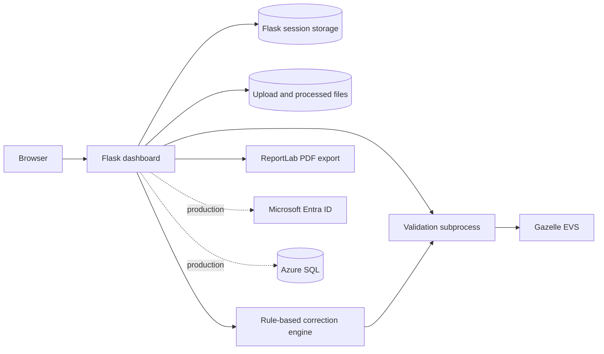

# HL7 v2 Message Validator and Auto-Corrector

A Flask application for validating Healthlink HL7 v2 XML messages with the Gazelle EVS service, reviewing validation reports, and applying deterministic corrections to supported message errors.

The application supports a lightweight local mode for development and a production mode with Microsoft Entra ID authentication and Azure SQL persistence. Its interface is built with Tailwind CSS and Lucide icons.

## Contents

- [Capabilities](#capabilities)
- [How it works](#how-it-works)
- [Quick start](#quick-start)
- [Configuration](#configuration)
- [Application modes](#application-modes)
- [Supported message profiles](#supported-message-profiles)
- [Architecture](#architecture)
- [Security and data handling](#security-and-data-handling)
- [AI-assisted development](#ai-assisted-development)
- [Development and verification](#development-and-verification)
- [Deployment](#deployment)
- [Troubleshooting](#troubleshooting)
- [Documentation](#documentation)

## Capabilities

- Upload one or more `.xml` or `.txt` HL7 v2 messages.
- Validate messages against configured Gazelle EVS profiles.
- Display validation status, message type, errors, warnings, and the Gazelle report link.
- Apply rule-based encoding, structural, code-table, and required-field corrections.
- Revalidate corrected messages iteratively, up to a configurable limit.
- Download corrected messages and export validation reports as PDF.
- Track batch upload and validation progress in the browser.
- Store results for the current local session or persist per-user history in Azure SQL.
- Manage Gazelle API credentials through the local session or encrypted production storage.

Auto-correction is intentionally conservative. A corrected message should still be reviewed before it is used in a clinical or production workflow.

## How it works

1. The browser uploads each selected message to Flask.
2. Flask stores the upload in a session-specific directory.
3. `validate_with_verification.py` submits the message to Gazelle EVS and parses its response.
4. If auto-correction is enabled and mandatory errors remain, the correction engine applies supported deterministic rules.
5. The corrected message is revalidated until it passes, no additional correction can be made, or the iteration limit is reached.
6. The dashboard presents the final status and makes the report and corrected file available.

The browser processes batch uploads sequentially. This avoids overwhelming the external validation service and provides clear per-file progress.

## Quick start

### Prerequisites

- Python 3.12
- A Gazelle EVS API key
- Git
- Docker Desktop, if using the container workflow

Production mode additionally requires a Microsoft Entra ID app registration and Azure SQL Database.

### Local Python on Windows

```powershell
git clone https://github.com/ddeveloper72/HL7_v2_Message_Validator-Auto-Correct.git
cd HL7_v2_Message_Validator-Auto-Correct

python -m venv .venv
.\.venv\Scripts\Activate.ps1
python -m pip install -r requirements.txt

Copy-Item .env.docker.example .env
python -c "import secrets; print(secrets.token_hex(32))"
```

Edit `.env` and set at least:

```env
APP_MODE=local
SESSION_SECRET_KEY=replace_with_the_generated_value
GAZELLE_BASE_URL=https://testing.ehealthireland.ie
VERIFY_SSL=true
```

Start the application:

```powershell
python dashboard_app.py
```

Open <http://127.0.0.1:5000>, navigate to the profile, and enter the Gazelle API key and its validity dates.

### Docker

```powershell
Copy-Item .env.docker.example .env
python -c "import secrets; print(secrets.token_hex(32))"
# Add the generated session secret to .env

docker compose up --build -d
docker compose logs -f web
```

Open <http://127.0.0.1:5000>, configure the Gazelle API key in the profile, and check service health at <http://127.0.0.1:5000/health>.

## Configuration

Configuration is loaded from environment variables and `.env` through `python-dotenv`.

### Core settings

| Variable | Required | Default | Purpose |
| --- | --- | --- | --- |
| `APP_MODE` | No | `local` | Use `local`, `development`, `production`, or `heroku`. |
| `SESSION_SECRET_KEY` | Production/Docker | Generated locally when absent | Signs Flask sessions. Set an explicit secret outside local development. |
| `GAZELLE_API_KEY` | Command-line fallback | None | Environment fallback used by the validation script. The web application uses the API key configured in the user session or production database. |
| `GAZELLE_BASE_URL` | No | Gazelle test service | Base URL for validation requests. |
| `VERIFY_SSL` | No | `true` | Controls TLS certificate verification for external requests. |
| `MAX_AUTO_CORRECT_ITERATIONS` | No | `10` | Maximum correction and revalidation cycles. |
| `OPEN_REPORT_BROWSER` | No | `false` | Controls automatic report opening in applicable command-line flows. |

### Production identity and database settings

| Variable | Purpose |
| --- | --- |
| `AZURE_AD_CLIENT_ID` | Microsoft Entra application client ID. |
| `AZURE_AD_CLIENT_SECRET` | Microsoft Entra application secret. |
| `AZURE_AD_TENANT_ID` | Microsoft Entra tenant ID. |
| `AZURE_AD_REDIRECT_URI` | Registered OAuth callback URI. |
| `AZURE_SQL_SERVER` | Azure SQL server hostname. |
| `AZURE_SQL_DATABASE` | Database name. |
| `AZURE_SQL_USERNAME` | Database username. |
| `AZURE_SQL_PASSWORD` | Database password. |
| `DB_DRIVER` | ODBC driver; the container uses `FreeTDS`. |
| `ENCRYPTION_KEY` | Fernet key used to protect stored API keys. |

Generate a Fernet key with:

```powershell
python -c "from cryptography.fernet import Fernet; print(Fernet.generate_key().decode())"
```

Never commit `.env`, session secrets, API keys, client secrets, or database credentials.

## Application modes

### Local mode

Local mode is intended for development, demonstrations, and single-user validation.

- Authentication is bypassed and a local developer session is created automatically.
- Azure SQL is used when available; otherwise results use temporary/session storage.
- The web interface stores the Gazelle API key in the browser-backed server session.
- Temporary processing metadata is stored in the operating system's temporary directory.

Set:

```env
APP_MODE=local
```

### Production mode

Production mode enables:

- Microsoft Entra ID sign-in
- Per-user validation history
- Azure SQL persistence
- Encrypted per-user Gazelle API key storage
- User profile and validation statistics

Set:

```env
APP_MODE=production
```

Production startup requires the identity, database, session, and encryption settings described above.

## Supported message profiles

The interface exposes the following configured profiles:

| Area | Message | Description |
| --- | --- | --- |
| Patient administration | `ADT^A01` | Patient admission |
| Patient administration | `ADT^A03` | Patient discharge |
| Patient administration | `ADT^A04` | Patient registration |
| Patient administration | `ADT^A08` | Patient update |
| Laboratory | `ORU^R01` | Laboratory result |
| Laboratory | `ORU^R03` | Unsolicited observation |
| Laboratory | `OML^O21` | Laboratory order |
| Laboratory | `ORL^O22` | Laboratory order response |
| Clinical | `REF^I12` | Discharge summary or referral |
| Clinical | `RRI^R12` | Radiology result |
| Clinical | `VXU^V04` | Vaccination update |
| Clinical | `SIU^S12` | Appointment notification |
| System | `ACK^GENERIC` | General acknowledgement |

Profile availability ultimately depends on the connected Gazelle EVS instance and its configuration.

## Architecture



### Important components

| Path | Responsibility |
| --- | --- |
| `dashboard_app.py` | Main Flask application, routes, sessions, authentication, reports, and orchestration. |
| `validate_with_verification.py` | Gazelle submission and validation-response parsing. |
| `hl7_corrector.py` | Deterministic HL7 correction rules. |
| `hl7_code_tables.py` | Loads and queries configured HL7 code tables. |
| `hl7_code_tables.json` | Data-driven code corrections and valid values. |
| `db_utils.py` | Azure SQL access, user records, validation history, and encrypted API keys. |
| `templates/` | Jinja templates for the Tailwind user interface. |
| `static/` | Shared CSS, JavaScript, and favicon assets. |
| `database_schema.sql` | Production database schema. |

The older `app.py` provides a separate, simpler validation interface. `dashboard_app.py` is the primary application entry point documented here.

## Security and data handling

The application includes:

- CSRF protection through Flask-WTF
- Server-side filesystem sessions
- HTTP-only and same-site session cookies
- Secure cookies in production
- Content Security Policy and other response security headers
- Request rate limiting, with targeted limits on sensitive write operations
- Filename sanitisation and upload type restrictions
- HTML sanitisation for rendered report content
- Parameterised database access
- Fernet encryption for API keys stored in production

Uploaded messages may contain personal or clinical data. Operators are responsible for confirming that use of the application and submission to Gazelle EVS comply with their organisation's security, privacy, retention, and data-processing requirements.

Local temporary files and session data are not a substitute for an approved clinical record system.

## AI-assisted development

Generative AI tools assisted with parts of this project's development, including code drafting, refactoring, user-interface work, debugging, and documentation. AI-generated suggestions were reviewed and integrated by the project maintainer; they should not be assumed to be independently verified or error-free.

The runtime auto-correction engine is deterministic and rule-based. It does not send message content to a generative AI model to decide corrections. Validation content is sent to the configured Gazelle EVS service as part of the application's core workflow.

See [docs/AI_USE.md](docs/AI_USE.md) for the project's disclosure, review expectations, and limitations.

## Development and verification

Compile the Python sources:

```powershell
.\.venv\Scripts\python.exe -m compileall dashboard_app.py validate_with_verification.py hl7_corrector.py
```

Check Jinja syntax:

```powershell
@'
from pathlib import Path
from jinja2 import Environment
for path in Path("templates").glob("*.html"):
    Environment().parse(path.read_text(encoding="utf-8"))
    print(f"OK {path}")
'@ | .\.venv\Scripts\python.exe -
```

Check the health endpoint after startup:

```powershell
Invoke-WebRequest -UseBasicParsing http://127.0.0.1:5000/health
```

The repository does not currently contain a comprehensive automated test suite. Changes to validation or correction rules should be checked with representative, non-production test messages and their Gazelle reports.

### Branch workflow

```powershell
git switch -c feature/short-description
# Make and verify changes
git add <files>
git commit -m "feat: describe the change"
```

## Deployment

The supplied Docker image runs Gunicorn with two synchronous workers and mounts directories for uploads, corrected files, and Flask sessions.

Detailed guides:

- [Docker deployment](DOCKER_DEPLOYMENT.md)
- [Docker configuration](DOCKER_CONFIGURATION.md)
- [Docker quick start](DOCKER_QUICK_START.md)
- [Azure requirements](AZURE_REQUIREMENTS.md)
- [Local development](LOCAL_DEVELOPMENT_GUIDE.md)

Before production deployment:

1. Use production mode and HTTPS.
2. Set stable, unique session and encryption keys.
3. Register the exact production redirect URI in Microsoft Entra ID.
4. Restrict Azure SQL firewall and credentials.
5. Confirm persistent volume behavior for the selected hosting platform.
6. Define message retention and deletion procedures.
7. Review external service and clinical-data governance requirements.

## Troubleshooting

### Tailwind or icons do not load

The Content Security Policy permits scripts from `cdn.jsdelivr.net`. The shared design system loads Tailwind Browser and Lucide from that origin. Check the browser console for CSP errors and perform a hard refresh after changing frontend assets.

### Dashboard returns HTTP 429

The read-only dashboard route is exempt from request limiting and does not poll itself. Restart Flask after updating from an older version so the current limiter configuration is loaded.

### Gazelle validation fails

- Confirm the API key and its expiry date.
- Confirm `GAZELLE_BASE_URL` points to the intended service.
- Keep `VERIFY_SSL=true` unless diagnosing a controlled local certificate issue.
- Review the Flask CLI output and the Gazelle report URL.

### PDF export is unavailable

Confirm ReportLab is installed in the active environment:

```powershell
python -m pip show reportlab
```

### Results disappear or differ between workers

Local mode uses temporary storage when SQL is unavailable. Production deployments should use Azure SQL for durable, multi-user history. Temporary files are not durable across host replacement or cleanup.

### Docker does not become healthy

```powershell
docker compose ps
docker compose logs web
docker compose exec web python -c "import requests; print(requests.get('http://localhost:5000/health').json())"
```

## Documentation

Start with the [documentation index](docs/README.md).

| Document | Purpose |
| --- | --- |
| [docs/AI_USE.md](docs/AI_USE.md) | AI-use disclosure and review expectations |
| [docs/architecture/README.md](docs/architecture/README.md) | Architecture diagram guidance |
| [LOCAL_DEVELOPMENT_GUIDE.md](LOCAL_DEVELOPMENT_GUIDE.md) | Local development workflow |
| [DOCKER_QUICK_START.md](DOCKER_QUICK_START.md) | Short Docker workflow |
| [DOCKER_CONFIGURATION.md](DOCKER_CONFIGURATION.md) | Local and production container configuration |
| [DOCKER_DEPLOYMENT.md](DOCKER_DEPLOYMENT.md) | Detailed container deployment and operations |
| [AZURE_REQUIREMENTS.md](AZURE_REQUIREMENTS.md) | Azure dependencies for production mode |

Historical implementation reports are retained under `docs/archive/`. They describe earlier states of the application and should not be treated as the current operating guide.

## Contributing

Keep changes focused, avoid committing secrets or real patient messages, and document material changes to configuration or runtime behavior. Pull requests should include the verification performed and any known limitations.

## Licence and status

No standalone open-source licence file is currently included. Treat the repository as an internal project unless the owner provides separate licensing terms.

This software supports testing and message-quality workflows. It is not a medical device, a clinical decision-support system, or a substitute for professional review.
