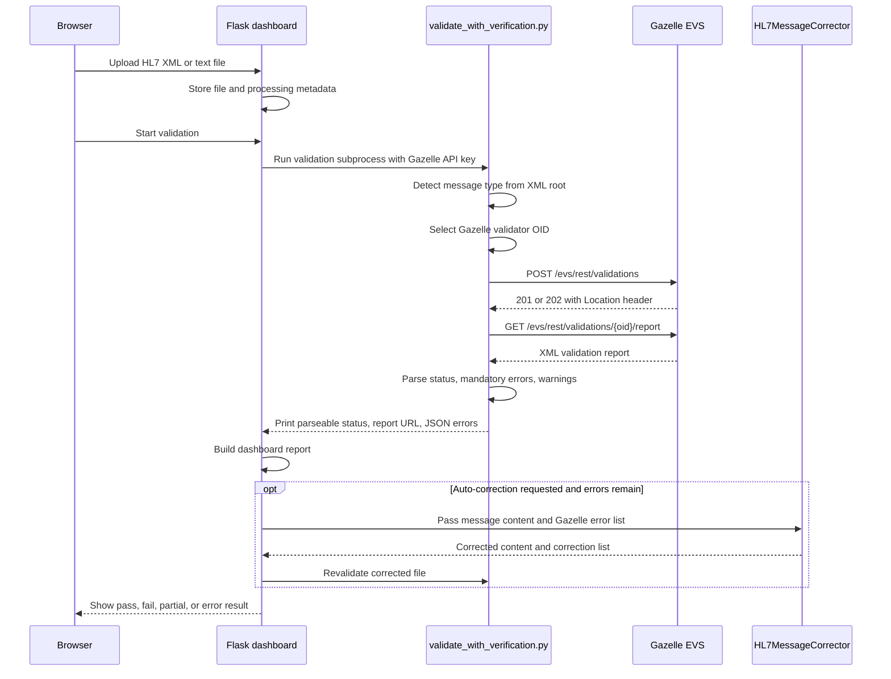

# Gazelle validation and correction flow

This document explains how the application connects to Gazelle EVS, how it chooses the validator to use, how it interprets pass, fail, and unknown results, and how Gazelle error reports are used by the auto-correction engine.

The current implementation is centred on:

- `dashboard_app.py`, which handles uploads, sessions, validation orchestration, reports, and the correction loop.
- `validate_with_verification.py`, which submits an HL7 v2 XML message to Gazelle EVS and prints parseable validation output.
- `hl7_corrector.py`, which applies deterministic message corrections, including corrections driven by Gazelle error details.
- `hl7_code_tables.py` and `hl7_code_tables.json`, which provide data-driven HL7 code-table checks and replacement values.

## High-level flow



## Connecting to Gazelle

The validation script reads the Gazelle base URL from `GAZELLE_BASE_URL`. If it is not set, it uses:

```text
https://testing.ehealthireland.ie
```

Validation submissions are sent to:

```text
{GAZELLE_BASE_URL}/evs/rest/validations
```

Reports are fetched from:

```text
{GAZELLE_BASE_URL}/evs/rest/validations/{oid}/report
```

The script sends the Gazelle API key in the `Authorization` header when a key is available:

```text
Authorization: GazelleAPIKey <api-key>
```

In the web application, the API key is taken from the current user session. In production mode, it can be loaded from encrypted per-user database storage. `dashboard_app.py` passes the key into the validation subprocess as the `GAZELLE_API_KEY` environment variable.

The primary validation path uses `GAZELLE_BASE_URL`. The fallback helper `fetch_and_parse_gazelle_report` in `dashboard_app.py` currently fetches reports from the eHealth Ireland test endpoint directly.

TLS verification is controlled by `VERIFY_SSL`, which defaults to enabled.

## How the validator is selected

`validate_with_verification.py` detects the message type from the XML root element.

For example:

```xml
<ORU_R01>
    ...
</ORU_R01>
```

The root name is mapped to an HL7 trigger event using `MESSAGE_TYPES`:

| XML root | Message type |
| --- | --- |
| `ADT_A01` | `ADT^A01` |
| `ADT_A03` | `ADT^A03` |
| `REF_I12` | `REF^I12` |
| `SIU_S12` | `SIU^S12` |
| `SIU_S13` | `SIU^S13` |
| `RRI_I12` | `RRI^I12` |
| `ORU_R01` | `ORU^R01` |

The detected message type is then mapped to a Gazelle validator OID using `VALIDATORS`:

| Message type | Gazelle validator OID |
| --- | --- |
| `ADT^A01` | `1.3.6.1.4.1.12559.11.35.10.1.7` |
| `ADT^A03` | `1.3.6.1.4.1.12559.11.35.10.1.9` |
| `REF^I12` | `1.3.6.1.4.1.12559.11.35.10.1.20` |
| `SIU^S12` | `1.3.6.1.4.1.12559.11.35.10.1.21` |
| `SIU^S13` | `1.3.6.1.4.1.12559.11.35.10.1.22` |
| `ORU^R01` | `1.3.6.1.4.1.12559.11.35.10.1.12` |

If the XML root cannot be mapped, or the message type has no configured validator OID, validation stops before submission and the script reports:

```text
ERROR: No configured Gazelle validator for message type Unknown
```

or the detected but unsupported message type.

## Submission payload

The script sends a JSON payload to Gazelle. The message file is base64 encoded before submission.

The payload shape is:

```json
{
  "objects": [
    {
      "originalFileName": "message.xml",
      "content": "<base64-message-content>"
    }
  ],
  "validationService": {
    "name": "Gazelle HL7v2.x validator",
    "validator": "1.3.6.1.4.1.12559.11.35.10.1.12"
  }
}
```

Gazelle should respond with HTTP `201` or `202`. The script reads the validation OID from the `Location` response header. If a privacy key is included in the `Location` query string, the script keeps it and appends it to the human-readable report URL.

## Fetching the Gazelle report

After submission, `validate_with_verification.py` polls the XML report endpoint:

```text
GET /evs/rest/validations/{oid}/report
```

The script retries for a limited number of attempts because Gazelle may need time to finish processing the validation.

When the XML report is available, the script parses the Gazelle validation-report namespace:

```text
http://validationreport.gazelle.ihe.net/
```

It extracts:

- the overall `validationTestResult`;
- each failed `constraint`;
- the constraint description;
- the location in the validated object;
- the constraint type;
- priority and severity attributes.

## Pass, fail, and unknown status handling

The validation script starts with:

```text
UNKNOWN
```

It then looks for `validationTestResult` in the XML report.

If Gazelle provides a result, that value is uppercased and used directly. Common values are:

| Status | Meaning in the application |
| --- | --- |
| `PASSED` | No mandatory validation failures remain. |
| `FAILED` | One or more mandatory errors failed validation. |
| `UNKNOWN` | The script could not determine a definitive result from the report. |

If the report status is still `UNKNOWN`, the script derives a status from the parsed constraints:

- if mandatory errors exist, it treats the message as `FAILED`;
- if no mandatory errors exist, it treats the message as `PASSED`.

The Flask route in `dashboard_app.py` also has a final fallback when parsing subprocess output:

- `UNKNOWN` with zero errors and zero warnings becomes `PASSED`;
- any other remaining `UNKNOWN` result becomes `FAILED`.

The correction loop also recognises `UNDEFINED` when it appears in validation output. That is treated as a non-passed state and can trigger pre-validation fixes such as byte order mark removal and XML declaration insertion.

## Parseable output returned to Flask

The validator script prints a small set of parseable lines. `dashboard_app.py` reads these lines from subprocess stdout.

Example:

```text
GAZELLE_OID=1.2.3.4.5
OID: 1.2.3.4.5
Message Type: ORU^R01
Status: FAILED
Errors: MANDATORY: 2)
Warnings: 1
Report: https://testing.ehealthireland.ie/evs/report.seam?oid=1.2.3.4.5
GAZELLE_ERRORS_JSON=[{"description":"...","location":"...","type":"Code","priority":"MANDATORY","severity":"ERROR"}]
GAZELLE_WARNINGS_JSON=[]
```

The most important fields for the dashboard are:

- `GAZELLE_OID`, used to identify the Gazelle validation.
- `Message Type`, shown in the report.
- `Status`, used for the dashboard pass/fail state.
- `Errors` and `Warnings`, used for counts.
- `Report`, used to link to the full Gazelle report.
- `GAZELLE_ERRORS_JSON`, used by the correction engine.
- `GAZELLE_WARNINGS_JSON`, stored for report context.

If the JSON error line is unavailable, `dashboard_app.py` can fetch and parse the XML report directly using `fetch_and_parse_gazelle_report`.

## Error report structure used by correction

Gazelle failed constraints are converted into dictionaries like this:

```json
{
  "description": "The value 'CLIP' is not member of the value set [HL70301_HL]",
  "location": "hl7shortpath:MSH[1]-6[1].3[1]",
  "type": "Code",
  "priority": "MANDATORY",
  "severity": "ERROR"
}
```

The application treats mandatory errors as correction candidates. Recommended warnings are kept for reporting, but the correction engine skips warnings.

The fields matter as follows:

| Field | How it is used |
| --- | --- |
| `description` | Parsed to identify missing fields, invalid codes, expected code systems, and value-set names. |
| `location` | Parsed to locate the segment, field, and component, such as `OBX[1]-3.3`. |
| `type` | Used to route to cardinality, usage, code, or component-specific fixes. |
| `priority` | Helps separate mandatory errors from recommended warnings. |
| `severity` | Warnings are skipped by the correction engine. |

## How Gazelle errors drive corrections

`HL7MessageCorrector.prepare_message` applies corrections in this order:

1. Remove a UTF-8 byte order mark if present.
2. Ensure the XML declaration exists.
3. Apply known code corrections using HL7 code tables.
4. Fill supported empty required fields.
5. Apply targeted fixes based on Gazelle error details.

The Gazelle-driven stage is implemented in `_apply_gazelle_error_fixes`.

It currently handles these broad cases:

| Gazelle error pattern | Correction path |
| --- | --- |
| Cardinality error with missing field text | `_fix_missing_field` |
| Code error where a value is not in a value set | `_fix_invalid_code` |
| Usage error with missing component text | `_fix_missing_component` |
| Required and missing text in the description | `_fix_missing_component` |

Examples of supported targeted fixes include:

- adding a placeholder for missing `SCH-20`;
- correcting invalid code systems in `CE.3`;
- replacing invalid code values with a valid value from the configured HL7 table;
- adding missing `OBX-3.3` coding system values;
- adding missing `OBR-4.3` coding system values;
- adding missing `SCH-6.3` coding system values.

Each correction is recorded with a type, location, old value, new value, reason, and source where available. The source is often `Gazelle Error Report` or `HL7 Code Tables (Data-Driven)`.

## Correction and revalidation loop

When auto-correction is requested, `dashboard_app.py` calls `retry_auto_correct`.

The loop works as follows:

1. Load the original message from temporary storage or the database.
2. Apply pre-validation encoding and structural fixes.
3. Save a corrected working file.
4. Validate the working file with Gazelle.
5. Parse the latest `GAZELLE_ERRORS_JSON`.
6. Stop if the message passed or no detailed errors remain.
7. Pass the current message and latest Gazelle errors into `HL7MessageCorrector`.
8. Save the newly corrected content.
9. Repeat until the message passes, no more corrections can be made, or `MAX_AUTO_CORRECT_ITERATIONS` is reached.

The default iteration limit is:

```text
10
```

At the end of the loop the application stores:

- final validation status;
- final error and warning counts;
- final Gazelle report URL;
- total corrections applied;
- number of iterations;
- corrected file path;
- a Markdown report describing original errors, corrections, remaining errors, and full validation output.

## Example: using a Gazelle report to correct a message

Suppose Gazelle returns this failed mandatory constraint:

```json
{
  "description": "The value 'CLIP' at location Component MSH-6.3 is not member of the value set [HL70301_HL]",
  "location": "hl7shortpath:MSH[1]-6[1].3[1]",
  "type": "Code",
  "priority": "MANDATORY",
  "severity": "ERROR"
}
```

The application handles it like this:

1. The validation script emits the error in `GAZELLE_ERRORS_JSON`.
2. `dashboard_app.py` stores the error as `detailed_errors`.
3. The auto-correction loop passes that list into `HL7MessageCorrector.prepare_message`.
4. `_apply_gazelle_error_fixes` sees a code-related error.
5. `_fix_invalid_code` extracts:
   - invalid value: `CLIP`;
   - value set/table: `HL70301`;
   - location: `MSH-6.3`.
6. The corrector checks the configured HL7 code tables.
7. If a valid replacement is available, the XML value is replaced.
8. The correction is recorded in the correction report.
9. The corrected file is submitted back to Gazelle for revalidation.

If Gazelle then returns `PASSED`, the dashboard marks the final result as passed. If Gazelle still returns mandatory errors, the loop tries the next supported corrections. If no supported correction applies, the result is partial and the remaining errors are shown for manual review.

## Important limitations

- The application only auto-corrects supported, deterministic error patterns.
- The validator mapping in `validate_with_verification.py` is the source of truth for actual Gazelle validator OIDs used by the current validation script.
- Some message profiles may appear in the user interface or README as intended supported profiles, but validation requires a corresponding entry in the script's `VALIDATORS` mapping.
- The correction engine does not use a generative AI model at runtime.
- Warnings are reported but generally not auto-corrected.
- A passed Gazelle result does not replace clinical, interoperability, privacy, or operational review.
